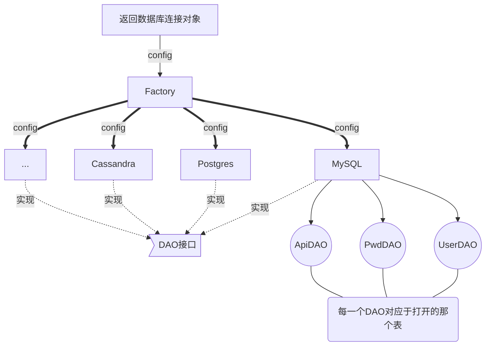

## luasql.mysql基本操作
``` lua
require "luasql.mysql"

--创建环境对象
env = luasql.mysql()

--连接数据库
conn = env:connect("数据库名","用户名","密码","IP地址",端口)

--设置数据库的编码格式
conn:execute"SET NAMES UTF8"

--执行数据库操作
cur = conn:execute("select * from role")

row = cur:fetch({},"a")

--文件对象的创建
file = io.open("role.txt","w+");

while row do
    var = string.format("%d %s\n", row.id, row.name)

    print(var)

    file:write(var)

    row = cur:fetch(row,"a")
end


file:close()  --关闭文件对象
conn:close()  --关闭数据库连接
env:close()   --关闭数据库环境
```

## 执行MySQL事务

```lua
--开始事务  
conn:execute([[START TRANSACTION;]])
--回滚事务
conn:execute([[ROLLBACK;]])
--提交事务
conn:execute([[COMMIT;]])

```


## 工厂模式
factory: 传入配置文件，建立数据库对象；根据配置文件指定的数据库类型加载相应的数据库操作；





